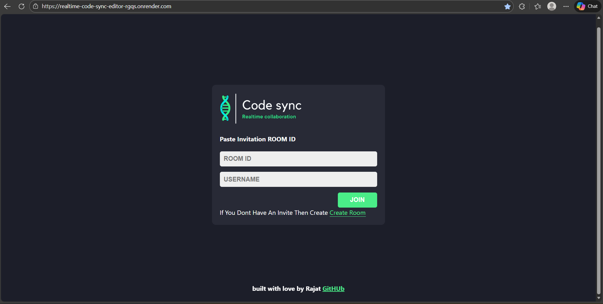
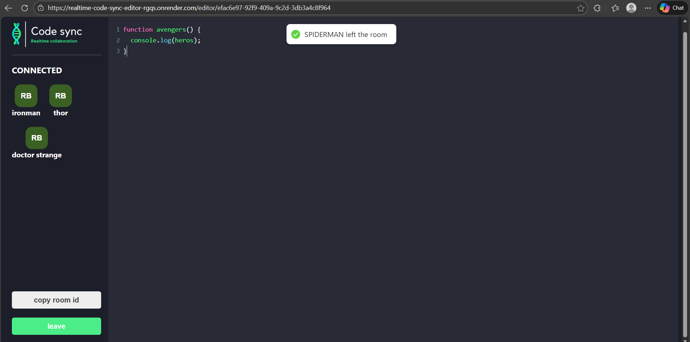

# 🚀 Realtime Collaborative Code Editor

A **production-ready realtime collaborative code editor** that enables multiple users to write and edit code together instantly.  
Designed to demonstrate **full-stack engineering skills**, **real-time system design**, and **scalable WebSocket communication**.

🔴 **Live Demo:** https://realtime-code-sync-editor-rgqs.onrender.com/

---

## 🎯 Project Objective 

This project was built to:
- Demonstrate **real-time data synchronization** using WebSockets
- Showcase **frontend + backend system design**
- Solve a **real developer problem**: collaborative coding without heavy IDEs

It reflects real-world use cases such as **pair programming, remote interviews, and online teaching**.

---

## 💡 Key Features 

- 🔄 **Realtime bi-directional communication** using Socket.IO  
- 🧩 **Room-based architecture** for scalable multi-user sessions  
- ⚡ **Low-latency code synchronization** across all connected clients  
- 🎨 **Developer-friendly code editor** with syntax highlighting  
- 🌐 **Deployed & production-tested** on Render  

---

## 🧠 System Architecture

**Frontend (React)**
- Manages editor state and user interactions  
- Emits code changes via WebSockets  
- Updates UI instantly on server broadcasts  

**Backend (Node.js + Express)**
- Manages room creation & user connections  
- Listens for editor updates  
- Broadcasts changes to all clients in the same room  

**Communication Layer**
- WebSockets (Socket.IO) for real-time, event-driven updates  

This architecture ensures **scalability, performance, and reliability**.

---

## 🛠️ Tech Stack

| Layer       | Technologies |
|------------|-------------|
| Frontend   | React.js, CodeMirror |
| Backend    | Node.js, Express.js |
| Realtime   | Socket.IO (WebSockets) |
| Deployment | Render |
| Version Control | Git, GitHub |

---

## 📸 Screenshots




---

## ⚙️ Local Setup (Optional for Reviewers)

```bash
git clone https://github.com/your-username/your-repo-name.git
cd your-repo-name
